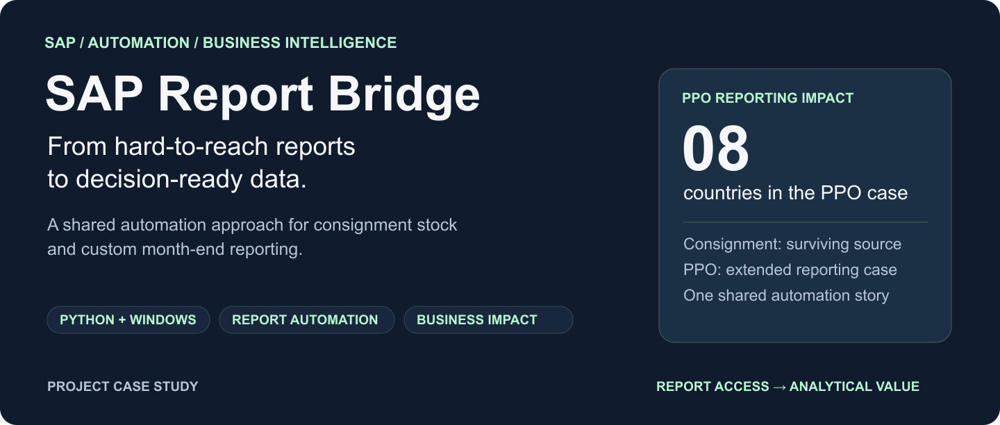

# SAP Report Bridge

**Turning hard-to-access SAP reports into repeatable inputs for management reporting.**

I built SAP desktop automation to close gaps in the data available through conventional BI connectors. The work supported custom month-end balance reporting across **8 countries** and reused the same early foundation for **consignment stock exports**.

| Focus | Business process automation · BI enablement · Reporting integration |
| :--- | :--- |
| **Technical foundation** | Python · pywinauto · Windows UI automation |
| **Downstream data stack** | pandas · CSV consolidation · Qlik |
| **Business users** | Country finance and regional management reporting teams |

## The problem I solved

The reporting team needed custom balances and customer-level detail that existing BI connectors did not expose. Local reporting dates and inclusion rules varied by country. Preparing PPO month-end balances meant maintaining a difficult Excel workbook, copying formulas as values and filtering unwanted items by hand.

Headless SAP access was unavailable under the existing user permissions. I used the interactive desktop route to make the required reports available for recurring and historical analysis.

## My contribution

- **Built the SAP acquisition workflow:** coordinated application windows, report parameters, export dialogs and output files.
- **Automated monthly filing:** created the correct year/month folders within the business's established structure.
- **Extended PPO for reporting continuity:** added historical batch extraction, download-completion checks, retries, and current/prior/year-opening balance-file coverage.
- **Reused the early foundation for consignment stock:** adapted report navigation and export handling to a second business need.

## Business impact

| Outcome | Value to the business |
| :--- | :--- |
| **Historical extraction across 8 countries** | Provided the foundation for a monthly balance database used in BI dashboards. |
| **Locally relevant reporting inputs** | Enabled country and regional management reports to include adjustments absent from standard connector feeds. |
| **Repeatable monthly acquisition** | Reduced manual downloading and filing; checked the periods needed for current reporting. |
| **Reuse across report types** | Applied the early approach to consignment stock and identified further use for granular customer sales history. |

Supporting Python/pandas code consolidates localized exports and preserves source-file and period metadata. A Qlik load script supplies the downstream consumption path.

## Engineering judgment

**Work within real access constraints.** Use the available interactive session and handle the window states it exposes.

**Design around reporting needs.** A new download alone is insufficient when reporting also depends on prior-period and year-opening balances.

**Reuse the approach, adapt the details.** Each SAP report needs its own parameters, navigation sequence, output format and checks.

## Two applications, one project

The surviving **consignment implementation** demonstrates Python/pywinauto navigation, organization loops, monthly folders, save-dialog handling and file-presence/recency checks. The extended **PPO case** demonstrates the additional historical and recurring-reporting controls described above.

**Portfolio scope:** the consignment source was inspected; the original PPO macro is unavailable, so advanced PPO behavior and business outcomes are documented from my project experience. The retained archive contains 84 monthly export files across eight sales organizations. This is a historical footprint, not a completeness audit or a measured time-saving claim. This showcase contains documentation and visuals; operational source and company data are excluded.

## See Also

[Architecture, flowcharts and implementation evidence](docs/ARCHITECTURE.md) · [Visual overview — download and open locally](preview.html) · [[ARCHITECTURE]]
