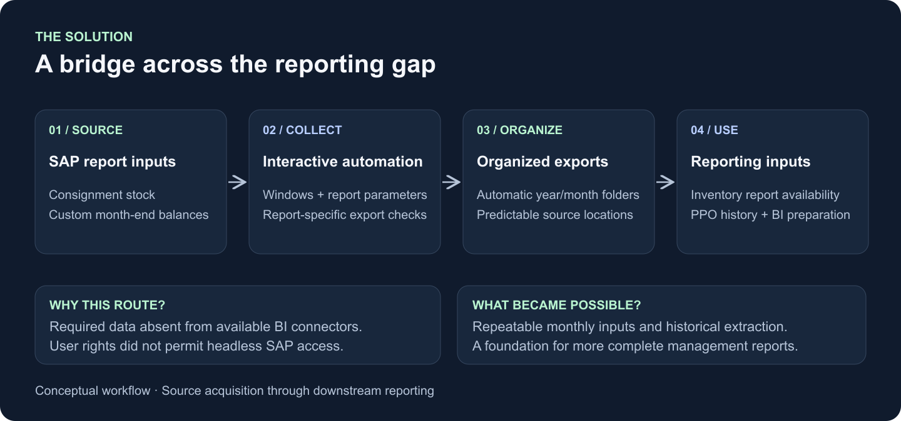

# SAP Reporting Automation

**Replaced about two hours of manual hands-on work with seconds to launch an unattended job—and supported its handover to a colleague.**

I built Python desktop automation to extract and organise SAP reports when standard reporting feeds did not provide the required detail. Historical extraction supported reporting across **eight countries**; my work also covered launch instructions, scheduling support and troubleshooting for another operator.

[Website case study](https://matthew-bangle-data-portfolio.mattbangle.chatgpt.site/work/sap-report-bridge) · [Handover evidence](docs/HANDOVER.md) · [Architecture](docs/ARCHITECTURE.md)

*Documentation case study with conceptual visuals. The comparison concerns hands-on effort, based on my operating experience. Archived run reports show examples of approximately 14–26 minutes of processing; the job did not finish in seconds. Output review and exception handling still required attention.*

## From personal automation to colleague use

Automating report navigation, parameter entry, exports and filing replaced repeated manual preparation. Just as importantly, I helped another person run the workflow through launcher and batch-file guidance, scheduled-run checks and follow-up on outputs and logging.

The retained evidence includes a colleague's successful run report and subsequent launcher and scheduling support. A failure report also records a practical lesson: inspect errors and outputs rather than treating a completion message as proof that every report is complete. The [handover brief](docs/HANDOVER.md) separates dated evidence from a new reusable operating checklist.

## Why this approach was needed

Country finance and regional management needed customer detail and reporting periods that standard business-intelligence connectors did not expose. The available route was an interactive SAP desktop session. Month-end pending-order balance reporting also involved country-specific dates and current, prior-period and opening balances.

I used **Python and pywinauto** to coordinate windows, report parameters and export dialogs, organised outputs by reporting period, and reused the early approach for consignment stock exports.

## Decisions behind the automation

**Work within the available access.** Use the authorised interactive session and design around its limitations.

**Start with the reporting need.** A successful download is not enough if the wrong period or required opening balance is missing.

**Make exceptions actionable.** Preserve failure information, identify affected outputs and help the operator recover without passing incomplete inputs into reporting.

**Reuse selectively.** Different SAP reports need different navigation, parameters and completion checks.

## Inspect the case

This is a documentation and visual case study. Original operational scripts, logs and employer data are excluded. The surviving consignment source was inspected privately; the original extended pending-order macro is unavailable, so its advanced historical extraction and recovery behaviour is described from my project experience.

- [Architecture and evidence](docs/ARCHITECTURE.md): observed implementation and reconstructed extensions.
- [Handover guide](docs/HANDOVER.md): colleague use, support and operating guidance.
- [Visual overview](preview.html): download the repository and open locally; GitHub does not execute the HTML preview.

The evidence supports less hands-on preparation and use beyond its author. The archived processing times are examples, not a runtime guarantee or an uptime measure.

[Matthew Bangle on LinkedIn](https://www.linkedin.com/in/matthew-bangle/) · [Full portfolio](https://matthew-bangle-data-portfolio.mattbangle.chatgpt.site/work)
