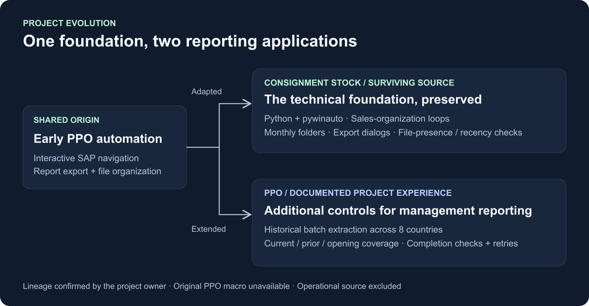
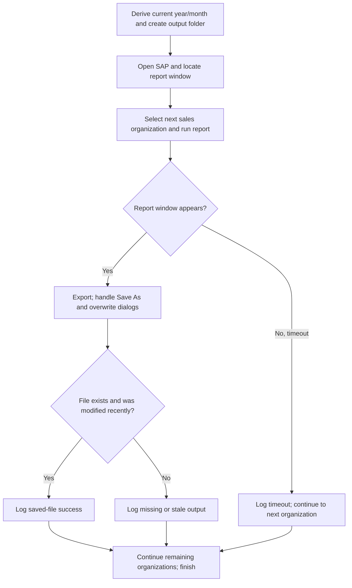
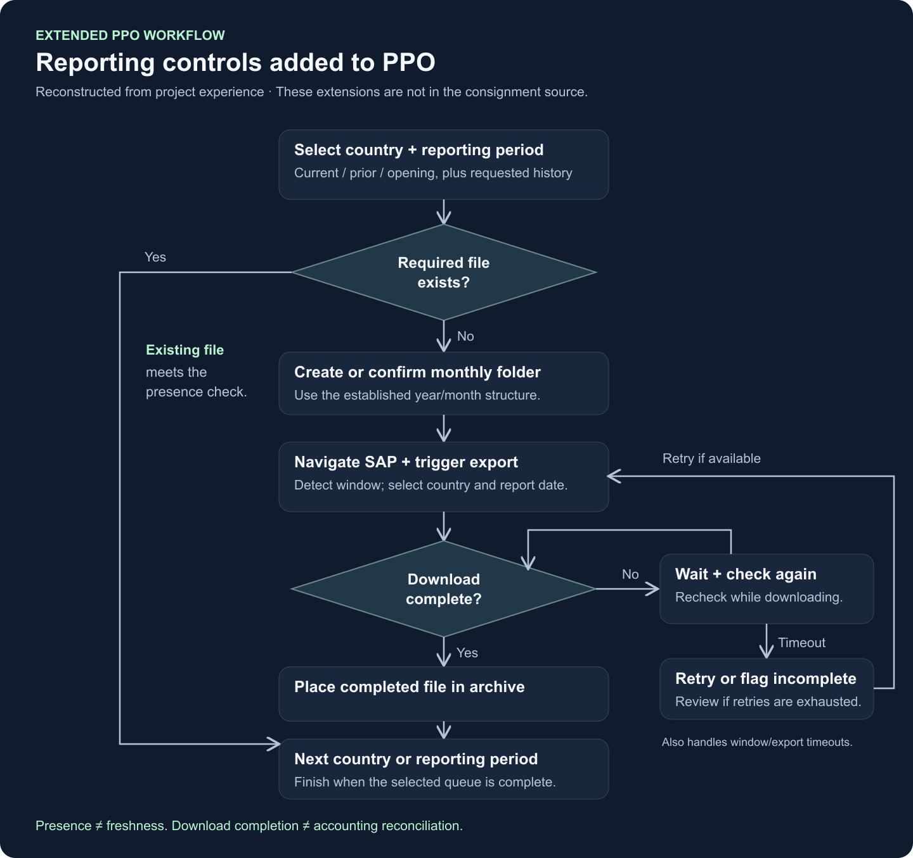
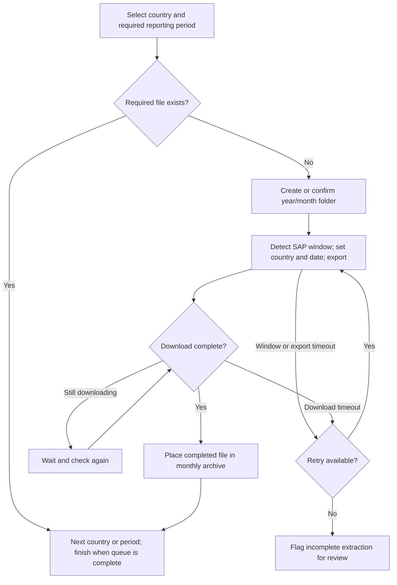

# Architecture & implementation evidence

**Shared SAP automation foundations, adapted to two reporting needs.**

The original PPO work established the early desktop automation approach. The consignment stock script was adapted from that foundation, while the PPO workflow subsequently gained additional reporting controls. This relationship is confirmed by the project owner; no source-history comparison is possible because the original PPO macro is unavailable.

## 1. Surviving implementation: consignment stock

The reviewed `sap_consignment.py` uses Python, `pywinauto` and clipboard-assisted input. Its responsibilities are concrete:

| Responsibility | Observed implementation |
| :--- | :--- |
| Prepare output location | Derives the year and a month folder such as `09. Sep`; creates the directory if absent. |
| Navigate SAP | Uses both UI Automation and Win32 window backends, window-title matching, focus control and keyboard input. |
| Recover during navigation | Retries report navigation and polls for expected windows; logs timeout/error conditions. |
| Process multiple organizations | Iterates through a sales-organization list supplied to the script. |
| Handle exports | Works through spreadsheet selection, Save As, and overwrite-confirmation dialogs. |
| Check output | Tests file existence and a modification time less than five minutes old. |

The companion `macro_launcher.py` checks monthly success-log coverage before invoking the consignment script.

These checks demonstrate practical desktop coordination. They do not establish file completeness, report-content validity, or accounting reconciliation. The surviving version mixes waits, polling and fixed delays; it does not implement the advanced PPO completion-monitoring loop or a general-purpose retry engine.

## 2. Extended workflow: PPO month-end reporting

The project's custom balance report, known internally as PPO, covered orders not yet finalized and recognized as revenue. Country-specific dates (*Stichtage*) and inclusion rules mattered, including differences between Italy and Spain. These are local business definitions, not a universal SAP report specification.

The project owner describes extending the PPO workflow with historical country/month extraction, download-completion monitoring, a robust retry loop, and checks for current-month, prior-month and year-opening balance files on each monthly run. The opening balance is a business-defined snapshot; it should not be assumed to mean January month-end.

*Reconstructed PPO operating flow from the owner's account, supported by historical artifacts. This is not a flowchart of the surviving consignment script. Exact completion tests, retry limits and queue behavior cannot be verified without the PPO source.*

Editable Mermaid: extended PPO workflow

## 3. From monthly files to analysis

The local PPO archive contains 84 monthly export files across eight sales organizations. Inspected Python/pandas code reads localized SAP exports, normalizes selected columns and European numeric formats, and retains source-file, organization and reporting-period metadata. A Qlik load script consumes the consolidated CSV.

Separate reconciliation code applies country-dependent filters and explores subsets against configured balance targets. Numeric matches help investigate definitions; they do not independently prove that an accounting rule is correct. These downstream artifacts support the PPO case and are not claimed as a verified consignment-to-Qlik deployment.

A separate Selenium experiment targets TM1 Web. It is adjacent work, distinct from the SAP desktop implementations.

## 4. Evidence boundaries

| Claim | Basis |
| :--- | :--- |
| Shared lineage | Project owner's confirmation that consignment was adapted from the early PPO foundation. |
| Consignment technical behavior | Surviving Python source and launcher inspected; no execution. |
| Advanced PPO controls and reporting outcomes | Owner's project account. A surviving macro log also records window retries/timeouts. |
| Historical data footprint | Export filename inventory; no contents or continuous-coverage audit. |
| Downstream preparation | Python and Qlik source inspection; no live reload or accounting validation. |

This documentation portfolio presents the engineering pattern and its evolution. A configurable report interface, central run manifest, and strict schema checks would be future enhancements. Original operational scripts and company data are excluded from the showcase.

## See Also

[Portfolio overview](../README.md) · [[README]]
